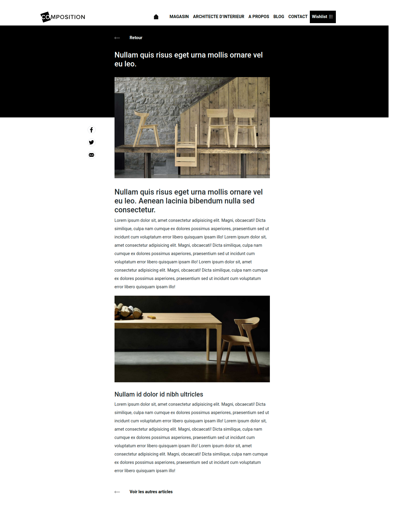
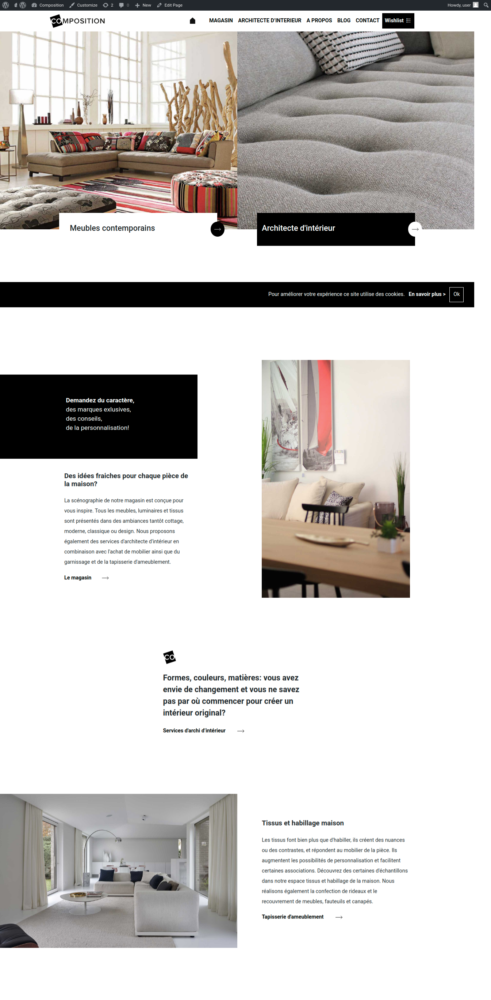

# cms-composition

# What is it?
It's a copy of a part of a WordPress site. It is a group project. 
I created these parts using ACF:
1. Home page. In general, it's responsive and respects the given design, but there is a small problem with a tablet version.
2. Header. It doesn't respect all requirements.
3. Blog-single. Not bad.

# What I think?
I am not satisfied with this work, and for me, WordPress is not so interesting, but anyway, it's very useful, because you can create a cool site very fast and the following changes can be done by users of the site.

# Feedback
Thank you for your comments.

